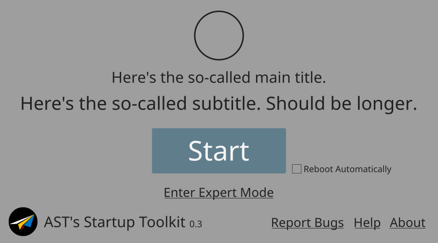
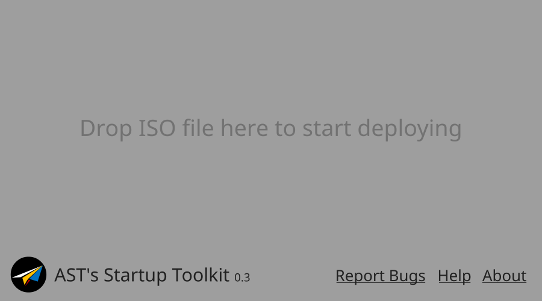
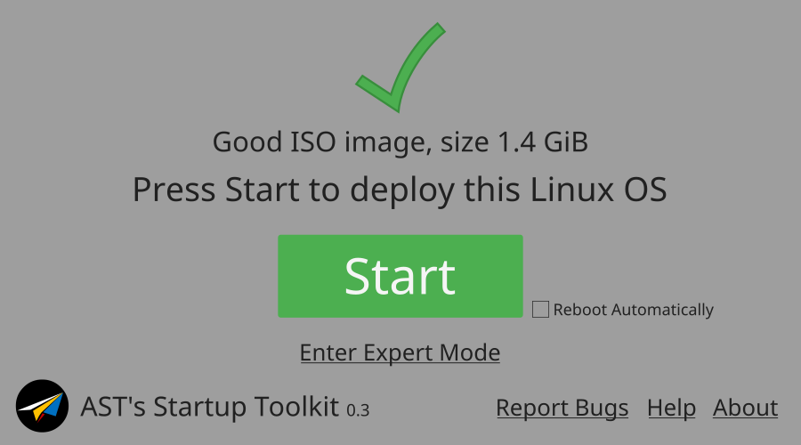
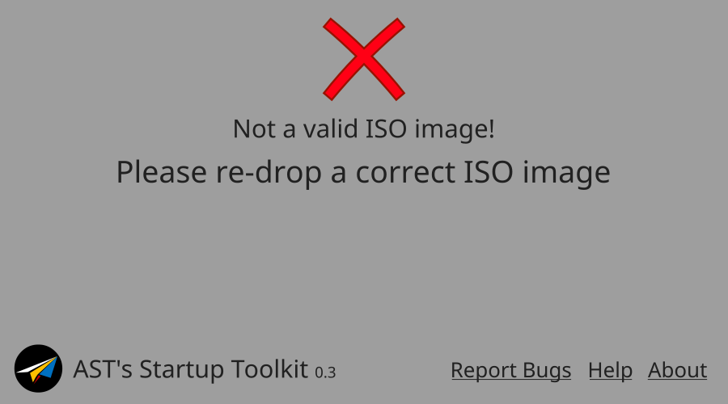
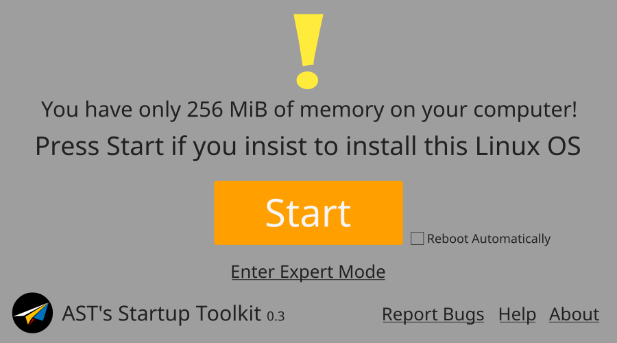

# AST's Startup Toolkit 0.3 GUI Design Specification

This file specifies the GUI design for AST's Startup Toolkit.

The color is for reference only.

## General: frmSimpMain

This is the easy mode of AST. At the top of the window there's a Logo that indicates the current status (e.g. ISO image status, running, etc).

The main title and the sub title are lables that provide text information to user. The reason why they're "so-called" is they're reused in different situations. See steps below for more information.

The "Start" button, as the name suggests, starts the process of deploying. During the process of deploying it can be also "Pause" button for users to stop the procedure, or terminate it.

The checkbox "Reboot Automatically" is put beside the "Start" button. If checked, AST will automatically reboot the computer as soon as the process finished. This checkbox remains visible and enabled until the process finished.

The link button "Enter Expert Mode" is used to enter the "expert mode", for advanced settings. See below for more information.

At the left of the bottom there's the Logo, name and version of AST. At the right side 3 link buttons make reporting bugs, checking help information, and having a look at the credits, legal information, easier. The elements at the bottom are constantly there.

## Step 1: Drop a file to start

This is the first scene that a user sees. The window receives `onDrop`-like signal -- just drag the ISO image file and release it into this UI AST will react and proceeds verification.

This grey message, which is in the position of the sub title, should be (1) not so "bright", and (2) at the center vertically (from the top of window to the top of bottom elements).

## Step 2: Verifying the file

When verifying an image file, this scene will appear. A spinner is shown on the top.

Note that because this indicates that AST is activated, the primary color should be brighter than Step 1.

## Step 3-1: Good ISO

If all are good, this scene is shown. A green check mark is shown , and the "Start" button turns green. The "main title" will print out brief information about the image file, while the sub title will inform user to continue.

## Step 3-2: Bad ISO

If some other things are dropped into AST, this scene is shown. A red cross mark is shown on the top.

**TBD: This design is severely unbalanced.** To reduce this problem we can set a timeout of 5 seconds, after which we can turn back to scene "Step 1".

## Step 3-3: Good ISO with insufficient configuration

AST may process system requirement verification before deploying. If some requirements are not sufficient for a Linux OS to install this warning scene will appear. A yellow exclamation mark will be on the top and the "Start" button is enabled with yellow or orange color, because (1) we don't guarantee what we detected are real and (2) user may know what he/she is doing so he/she can still press "Start" to go on.
